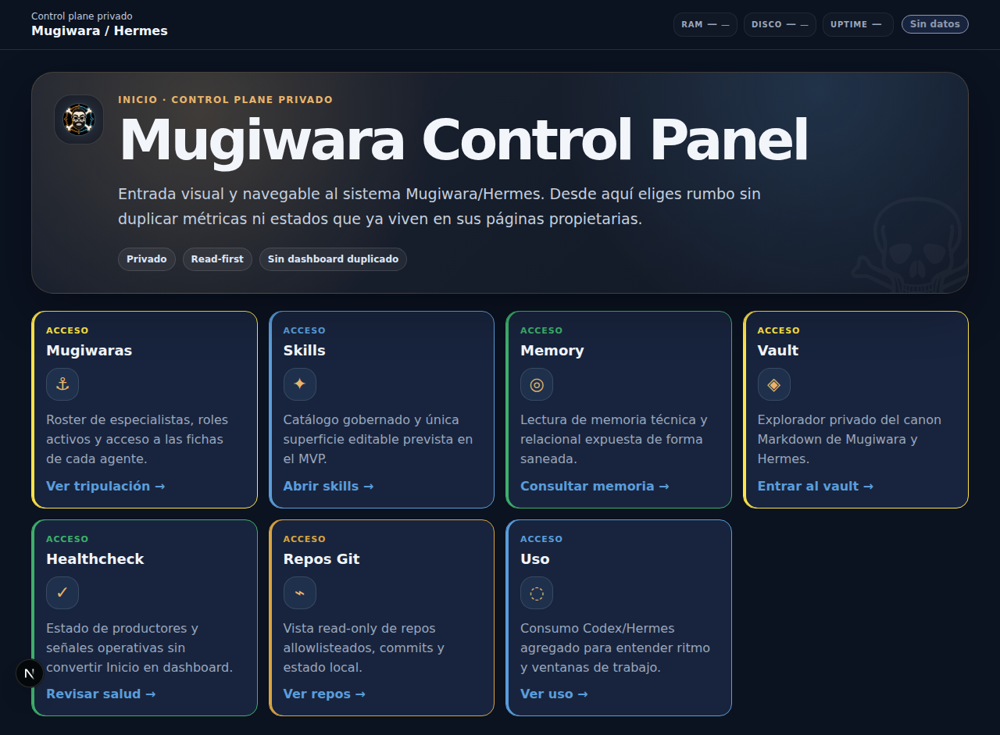
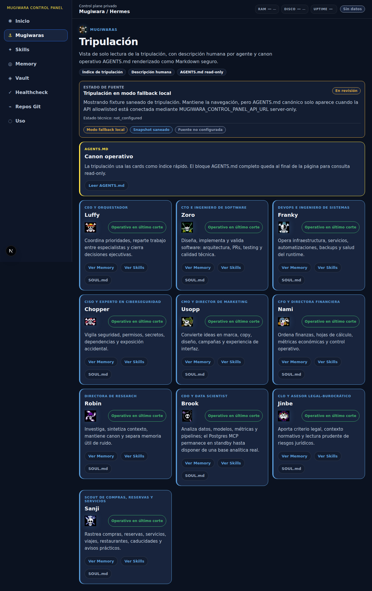
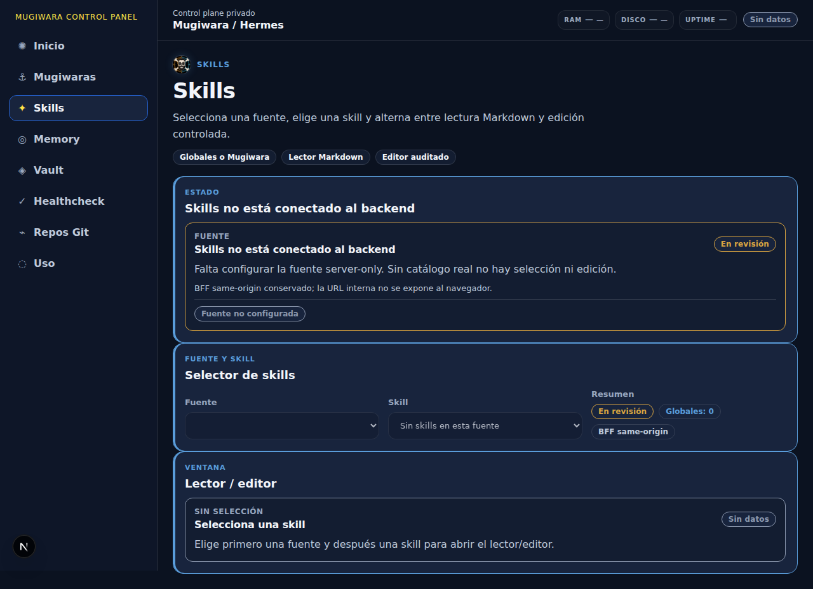
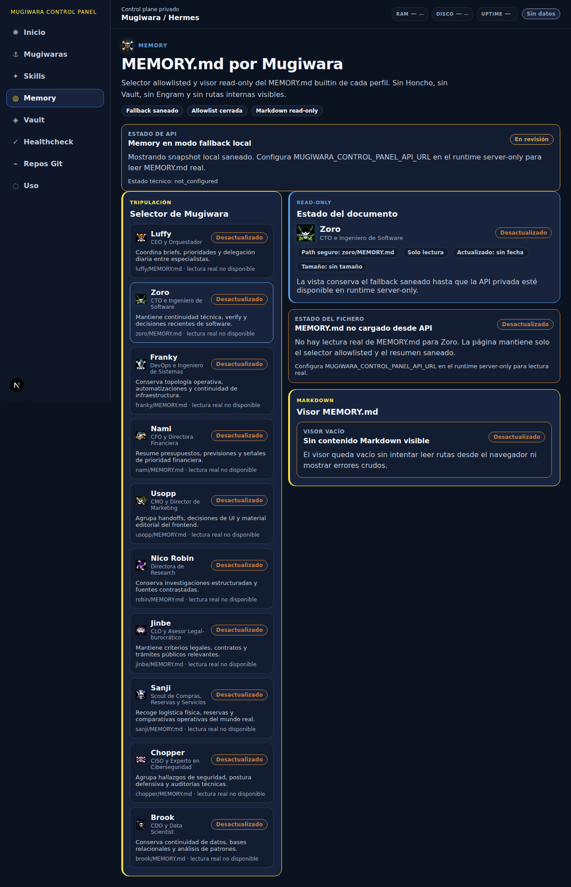
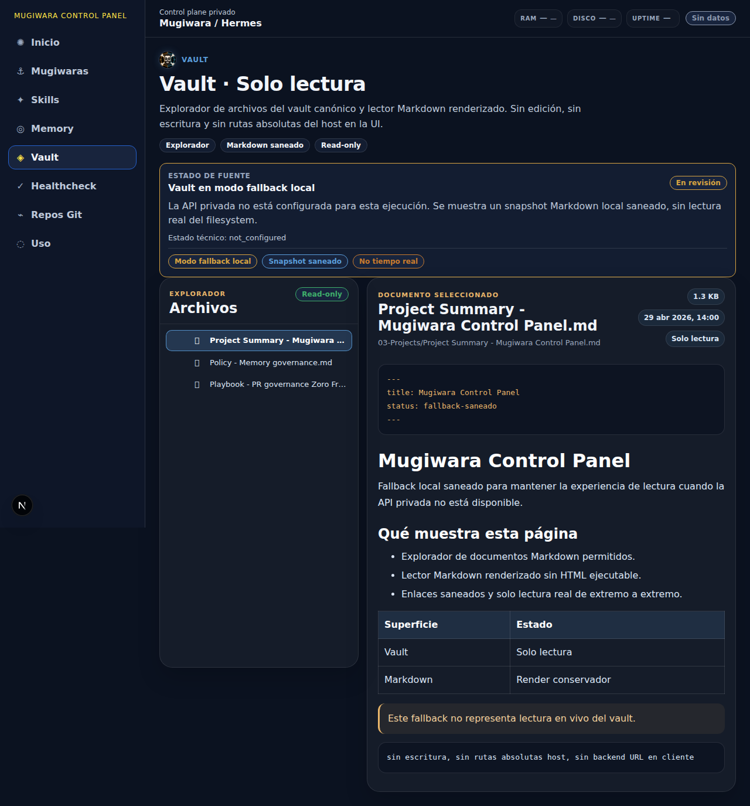
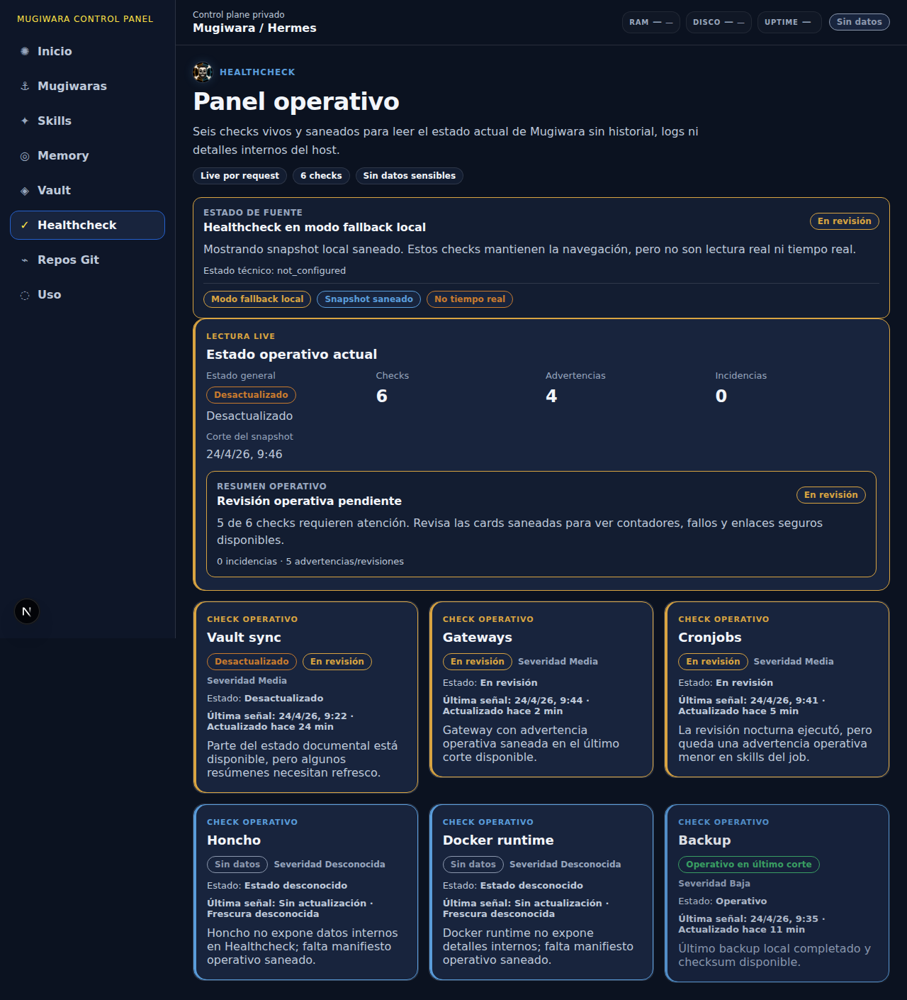
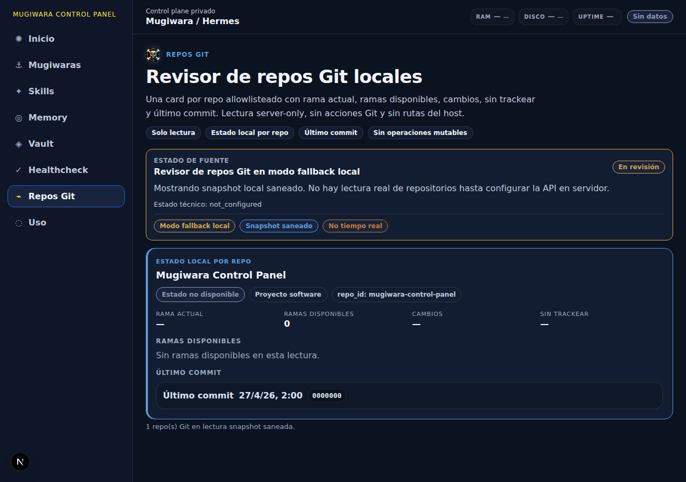
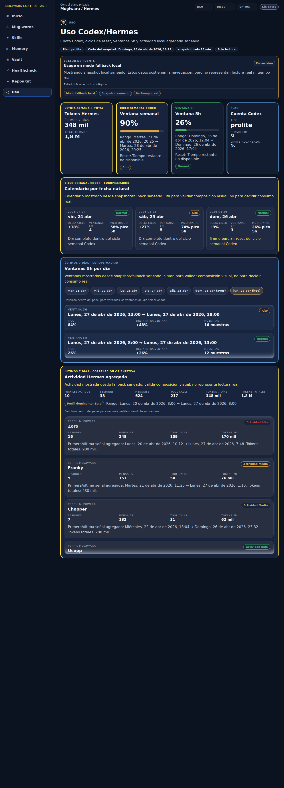

# 🕹️ Mugiwara Control Panel

> El puente de mando privado de Mugiwara/Hermes: una consola para mirar el barco, leer sus señales y navegar el sistema sin abrir la sala de máquinas.

`mugiwara-control-panel` es el **control plane privado** de Mugiwara/Hermes. Su código puede enseñarse; su operación real, sus datos vivos y sus llaves se quedan bajo cubierta.

La idea es sencilla: cuando una tripulación de agentes crece, no basta con tener buenos perfiles. Hace falta una consola que responda rápido a tres preguntas:

1. **qué está pasando** en el sistema,
2. **dónde vive cada capa** —skills, memoria, vault, repos, healthchecks—,
3. **qué se puede tocar y qué solo se puede mirar**.

Aquí mandan dos reglas: claridad de puente de mando y prudencia de bodega cerrada. ⚓

## ✨ Qué aporta

- **Inicio navegable** como portada privada del producto, sin duplicar métricas ni estados propietarios.
- **Fichas Mugiwara** para ver roles, responsabilidades y señales saneadas de la tripulación.
- **Catálogo de skills** con lectura, auditoría y edición controlada solo donde toca.
- **Memory** como lectura separada de memoria operativa, sin mezclarla con canon documental.
- **Vault** como navegación del conocimiento curado.
- **Healthcheck** para observar señales de sistema sin publicar logs crudos.
- **Repos Git** en modo seguro: repos allowlisteados, historial y diffs saneados.
- **Uso** para representar consumo agregado sin convertir métricas privadas en espectáculo público.

## 🧭 Principio editorial y de producto

Este panel no quiere parecer una demo de juguete ni una cabina de avión ilegible.

Quiere sentirse como:

- **mission control privado**, porque ayuda a operar;
- **bitácora navegable**, porque ordena conocimiento;
- **interfaz Mugiwara**, porque tiene carácter sin perder seriedad;
- **producto seguro por defecto**, porque no todo lo útil debe ser publicable.

La UI enseña estados y rutas de lectura. La seguridad vive detrás: backend, allowlists, saneado, server-only y deny-by-default.

## 🖼️ Capturas del panel

Las capturas siguientes muestran la línea visual y la estructura real de páginas del panel en un corte concreto. No son mockups: enseñan el estado del producto con sus módulos, jerarquía y microcopy operativo, sin publicar secretos, credenciales ni configuración runtime.

| Inicio | Mugiwaras |
|---|---|
|  |  |

| Skills | Memory |
|---|---|
|  |  |

| Vault | Healthcheck |
|---|---|
|  |  |

| Repos Git | Uso |
|---|---|
|  |  |

## 🧱 Arquitectura en corto

- **Frontend:** Next.js
- **Backend:** FastAPI
- **Acceso remoto previsto:** Tailscale / perímetro privado
- **Arquitectura:** monolito modular con separación por apps y paquetes
- **Frontera de seguridad:** backend server-only, allowlists explícitas y salidas saneadas

```text
apps/
├── web      # shell Next.js y experiencia de control plane
└── api      # frontera backend y adaptadores seguros

packages/
├── contracts
└── ui

docs/        # documentación viva del producto
openspec/    # specs y fases de evolución
```

## 🔐 Reglas de seguridad del repo

Este repositorio está pensado para exposición pública, así que la disciplina no es decoración:

- revisar `.gitignore` en cada cambio relevante;
- no subir secretos, `.env`, credenciales, logs sensibles ni artefactos locales;
- no publicar datos reales de healthchecks, memoria, uso, vault o runtime;
- mantener `AGENTS.md`, `docs/` y README alineados con el estado real;
- preferir capturas revisadas antes que screenshots improvisados del entorno privado.

Regla de cubierta:

> si una pieza mejora la comprensión sin aumentar la exposición, puede subir; si revela más de lo que explica, se queda fuera.

## 🧪 Scripts útiles

```bash
npm run dev:web
npm run build:web
npm run typecheck:web
npm run verify:memory-server-only
npm run verify:mugiwaras-server-only
npm run verify:skills-server-only
npm run verify:vault-server-only
npm run verify:health-dashboard-server-only
npm run verify:git-server-only
npm run verify:usage-server-only
```

## ⚙️ Configuración runtime

Ver [`docs/runtime-config.md`](docs/runtime-config.md).

Resumen actual:

- `/`, `/memory`, `/mugiwaras`, `/skills`, `/vault`, `/healthcheck`, `/usage` y `/git` dependen de fuentes server-only o BFF seguro donde aplica; `/dashboard` redirige a `/`.
- `/skills` expone al navegador solo endpoints BFF same-origin bajo `/api/control-panel/skills/**`; la URL real del backend no entra en el bundle cliente.
- Las pantallas con fallback lo declaran como fallback: nada de telemetría mágica, nada de fingir tiempo real.

## 🔗 Proyecto hermano

El escaparate público del sistema Mugiwara/Hermes vive en:

- [`mugiwara-no-hermes`](https://github.com/asistentes-mugiwara/mugiwara-no-hermes)

Allí se explica el modelo público de arquitectura, memoria, gobierno y frontera entre sistema vivo y escaparate. Este repo implementa una pieza concreta de ese ecosistema: la consola privada de observabilidad y navegación.

## 🧠 OpenCode + Engram

Siempre abrir OpenCode desde la raíz del proyecto:

```bash
cd /srv/crew-core/projects/mugiwara-control-panel
opencode
```

Esto garantiza contexto correcto para agentes SDD y actualización de Engram en el espacio adecuado.

## 👑 Cierre

`mugiwara-control-panel` no intenta enseñar todas las tuberías.

Intenta enseñar algo más útil:

> una forma seria, clara y con carácter de gobernar un sistema multiagente sin convertir la operación privada en escaparate imprudente.

Buen rumbo. ⚓
